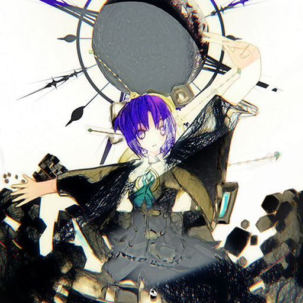

# Carlos Cabi

Mis inicios en este maravilloso mundo de la programacion comenzaron desde finales de Febrero de 2020 debido a "simple curiosidad"
Ahora que ya pasaron, cuantos?, seis meses?. Pues ya sabemos las bases de unas cuantas tecnologias considerables como:

- HTML & CSS
- Javascript
- Git & Github
- Markdown
- Webpack
- Node.js
- SQL

Obviamente solo las bases

---

## Cosas que no tiene nada que ver con esto?

No se que hacer con mi vida, pero me encanta programar y me gustaria tener una laptop mas mejorcita

Mis pasatiempos es solo estudiar, escuchar musica, comer y dormir

que ganas de salir del pais

y

solo he tenido dos novias, que no duraron nada xd

_It's not real_
**Carlos Cabi** <3

